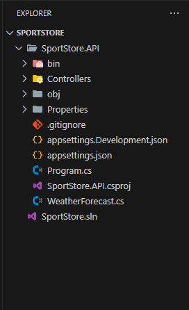
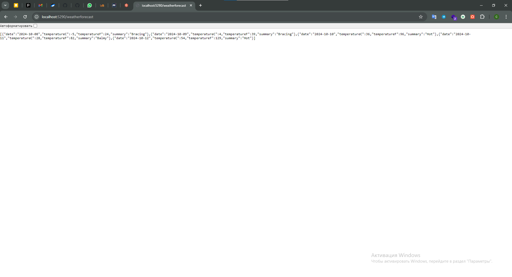

# Sprint 1 Introduction
---

## Проекта API. Тип архитектуры: All-In

Реализовать базовую функциональность API

### Использование dotnet CLI

- создайте папку SportStore и перейдите в нее.
- посмотрите с помощью команды ```dotnet new list``` список доступных проектов и создайте проект ```webapi``` с именем ```SportStore.API```
- добавьте файл решения, находясь в папке рабочей директории, командой ```dotnet new sln```
- добавьте в решение проект API - ```dotnet sln add SportStore.API```
- добавьте файл gitignore (на уровне рабочей директории) - ```dotnet new gitignore```

- откройте начальную архитектуру проекта в Visual Code командой ```code .```

В результате вид обозревателя должен получиться такой:



Для проверки работоспособности приложения запустите API 

```dotnet run --project SportStore.API```.

 У вас по конечной точке http://localhost:5290/weatherforecast должен выводится результат в формате json.

 Примечание: номер порта может быть другим.



- добавьте в решение файл readme.md
- настройка Visual Code(exlude obj and bin, prefix _)
- настройка среды разработки (Visual Code, Visual Studio, Rider)
- фиксация изменений в git в master
- от мастер создать ветку ```git branch all-in``` и перейти в нее ```git checkout all-in```. Далее работа будет вестись в этой ветке.

## Разработка домена приложения. Модель пользователя

Создайте в проекте ```SportStore.API``` папку ```Entities```, в которой создайте класс **User**

```Csharp
public class User{

    public Guid Id {get; set;}
    public string Name {get ;set;}

}
```
**Замечание**: тип Guid будет пока использоваться для локальной разработки без использования базы данных


# Интерфейсы

Создайте папку Interfaces и поместите следующий класс

```Csharp
public interface IUserRepository
{
   User CreateUser(User user);
   List<User> GetUsers();
   User EditUser(User user, Guid id);
   bool DeleteUser(Guid id);
   User FindUserById(Guid id);
}
```

# Паттерн репозиторий

Создайте папку ```Repositories``` и поместите там следующий класс, который будет имлементировать (реализовывать) интерфейс IUserRepository.

```Csharp
public class UserRepository : IUserRepository
{
    public IList<User> Users { get; set; } = new List<User>();  

    public User CreateUser(User user)
    {
       user.Id = Guid.NewGuid();
       Users.Add(user);
       return user;
    }

    public bool DeleteUser(Guid id)
    {
        var result = FindUserById(id);
        Users.Remove(result);
        return true;
    }

    /// <summary>
    /// Редактирование пользователя
    /// </summary>
    /// <param name="user"></param>
    /// <param name="id"></param>
    /// <returns></returns>
    public User EditUser(User user, Guid id)
    {
       var result = FindUserById(id);
       // update
       result.Name = user.Name;
       return result;
    }

    public User FindUserById(Guid id)
    {
        var result = Users.Where(u => u.Id == id).FirstOrDefault();

       if(result == null){
         throw new Exception($"Нет пользователя с id = {id}");
       }

       return result;
    }

    public List<User> GetUsers()
    {
       return (List<User>)Users;
    }
}
```

# Реализация CRUD в UserRepository
Задание: реализуйте методы, которые будут составлять CRUD операции для User

# Unit Test

- запуск всех тестов ```dotnet test```
- просмотр все доступных тестов ```dotnet test --list-tests```
- запуск конкретного списка по фильтру ```dotnet test dotnet test --filter "FullyQualifiedName=xunit.UserRepositoryTests.FindUserById_ShouldThrowExceptionForNonExistentId" ```


# DI


# Validation
DataAnnotation и FluentValidation


# Postman(Swagger,request.http) для тестирования API


# Асинхронность. Работа с Task


---
# Entity Framework Core

Установить пакеты:

- Microsoft.EntityFrameworkCore
- Microsoft.EntityFrameworkCore.Tools
- Microsoft.EntityFrameworkCore.Design

При установке пакетов надо соблюдать версионность относительно версии .net. В данном приложении применяется ```net7.0```

В результате добавления пакетов ```project``` файл ```SportStore.API``` будет выглядеть следующим образом:

```xml
<Project Sdk="Microsoft.NET.Sdk.Web">

  <PropertyGroup>
    <TargetFramework>net7.0</TargetFramework>
    <Nullable>enable</Nullable>
    <ImplicitUsings>enable</ImplicitUsings>
  </PropertyGroup>

  <ItemGroup>
    <PackageReference Include="Microsoft.AspNetCore.OpenApi" Version="7.0.5" />
    <PackageReference Include="Microsoft.EntityFrameworkCore" Version="7.0.20" />
    <PackageReference Include="Microsoft.EntityFrameworkCore.Design" Version="7.0.20">
      <IncludeAssets>runtime; build; native; contentfiles; analyzers; buildtransitive</IncludeAssets>
      <PrivateAssets>all</PrivateAssets>
    </PackageReference>
    <PackageReference Include="Microsoft.EntityFrameworkCore.Tools" Version="7.0.20">
      <IncludeAssets>runtime; build; native; contentfiles; analyzers; buildtransitive</IncludeAssets>
      <PrivateAssets>all</PrivateAssets>
    </PackageReference>
    <PackageReference Include="Swashbuckle.AspNetCore" Version="6.4.0" />
  </ItemGroup>

</Project>
```

Создайте папку ```Data``` и добавьте класс ```SportStoreContext```

```Csharp
public class SportStoreContext : DbContext
{
    public DbSet<User> Users { get; set; }
    
    protected override void OnConfiguring(DbContextOptionsBuilder optionsBuilder)
    {
        optionsBuilder.UseNpgsql("Host=localhost;Port=5432;Database=SportStoreCourse;Username=;Password=");
    }
}
```

В параметрах подключения к базе данных поставьте свой UserName и Password

# Миграции

В рабочей директории создайте первую миграцию.

```dotnet ef migtations add Initial -s SportStore.API -p SportStore.API```

Далее, выполните эту миграцию. То есть EF создаст реальные таблицы в базе данных PostgreSQL.

```dotnet ef update database -s SportStore.APi -p SportStore.API```

**Замечание**: -s - это стартовый проект, -p - это текущий проект. Либо, можно зайти в проект ```SportStore.API``` явно и не прописывать данные параметры.


Результат:
- branch:spring1:Introduction
- pullRequest